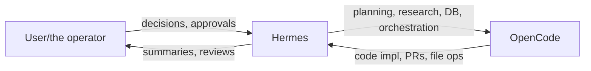

# OpenCode CLI

Use [OpenCode](https://opencode.ai) as an autonomous coding worker orchestrated by Hermes terminal/process tools. OpenCode is a provider-agnostic, open-source AI coding agent with a TUI and CLI.

## When to Use

- User explicitly asks to use OpenCode
- You want an external coding agent to implement/refactor/review code
- You need long-running coding sessions with progress checks
- You want parallel task execution in isolated workdirs/worktrees
- **Three-way collaboration:** User ↔ Hermes ↔ OpenCode — Hermes plans/researches/orchestrates, OpenCode codes, User decides
- **Reading past sessions:** Use `opencode export <sessionID>` to inspect what OpenCode did in previous conversations (messages, tool calls, costs per turn)
- **Delegating as ACP subagent:** Use `delegate_task` with `acp_command="opencode"` and `acp_args=["acp"]` for native subagent integration

### Capabilities Beyond Coding

OpenCode is more than a coding agent. It has its own:
- **Skill system** — reusable workflows and procedures
- **MCP server support** — can run and manage MCP servers via its `opencode mcp` command
- **Session management** — `opencode session list`, `opencode export`, `opencode stats`
- **Provider-agnostic routing** — picks models from any configured provider (OpenCode Go, Nvidia, OpenRouter, etc.)

## Prerequisites

- OpenCode installed: `npm i -g opencode-ai@latest` or `brew install anomalyco/tap/opencode`
- Auth configured: `opencode auth login` or set provider env vars (OPENROUTER_API_KEY, etc.)
- Verify: `opencode auth list` should show at least one provider
- Git repository for code tasks (recommended)
- `pty=true` for interactive TUI sessions

## Binary Resolution (Important)

Shell environments may resolve different OpenCode binaries. If behavior differs between your terminal and Hermes, check:

```
terminal(command="which -a opencode")
terminal(command="opencode --version")
```

If needed, pin an explicit binary path:

```
terminal(command="$HOME/.opencode/bin/opencode run '...'", workdir="~/project", pty=true)
```

## One-Shot Tasks

Use `opencode run` for bounded, non-interactive tasks:

```
terminal(command="opencode run 'Add retry logic to API calls and update tests'", workdir="~/project")
```

Attach context files with `-f`:

```
terminal(command="opencode run 'Review this config for security issues' -f config.yaml -f .env.example", workdir="~/project")
```

Show model thinking with `--thinking`:

```
terminal(command="opencode run 'Debug why tests fail in CI' --thinking", workdir="~/project")
```

Force a specific model:

```
terminal(command="opencode run 'Refactor auth module' --model openrouter/anthropic/claude-sonnet-4", workdir="~/project")
```

## Interactive Sessions (Background)

For iterative work requiring multiple exchanges, start the TUI in background:

```
terminal(command="opencode", workdir="~/project", background=true, pty=true)
# Returns session_id

# Send a prompt
process(action="submit", session_id="<id>", data="Implement OAuth refresh flow and add tests")

# Monitor progress
process(action="poll", session_id="<id>")
process(action="log", session_id="<id>")

# Send follow-up input
process(action="submit", session_id="<id>", data="Now add error handling for token expiry")

# Exit cleanly — Ctrl+C
process(action="write", session_id="<id>", data="\x03")
# Or just kill the process
process(action="kill", session_id="<id>")
```

**Important:** Do NOT use `/exit` — it is not a valid OpenCode command and will open an agent selector dialog instead. Use Ctrl+C (`\x03`) or `process(action="kill")` to exit.

### TUI Keybindings

| Key | Action |
|-----|--------|
| `Enter` | Submit message (press twice if needed) |
| `Tab` | Switch between agents (build/plan) |
| `Ctrl+P` | Open command palette |
| `Ctrl+X L` | Switch session |
| `Ctrl+X M` | Switch model |
| `Ctrl+X N` | New session |
| `Ctrl+X E` | Open editor |
| `Ctrl+C` | Exit OpenCode |

### Resuming Sessions

After exiting, OpenCode prints a session ID. Resume with:

```
terminal(command="opencode -c", workdir="~/project", background=true, pty=true)  # Continue last session
terminal(command="opencode -s ses_abc123", workdir="~/project", background=true, pty=true)  # Specific session
```

## Common Flags

| Flag | Use |
|------|-----|
| `run 'prompt'` | One-shot execution and exit |
| `--continue` / `-c` | Continue the last OpenCode session |
| `--session <id>` / `-s` | Continue a specific session |
| `--agent <name>` | Choose OpenCode agent (build or plan) |
| `--model provider/model` | Force specific model |
| `--format json` | Machine-readable output/events |
| `--file <path>` / `-f` | Attach file(s) to the message |
| `--thinking` | Show model thinking blocks |
| `--variant <level>` | Reasoning effort (high, max, minimal) |
| `--title <name>` | Name the session |
| `--attach <url>` | Connect to a running opencode server |

## ACP Integration

OpenCode v1.15.6+ implements the Agent Client Protocol (ACP) over stdio via `opencode acp`.
This lets Hermes spawn OpenCode as a native ACP subagent using the same JSON-RPC 2.0 protocol
that the Copilot ACP client uses.

### ACP Protocol Compatibility

The `opencode acp` command supports these methods Heres expects:

| Method | Status | Notes |
|--------|--------|-------|
| `initialize` | ✅ | Returns `protocolVersion: 1`, agent info, capabilities |
| `session/new` | ✅ | Creates session with `cwd`, `mcpServers`; returns `sessionId` + model config |
| `session/prompt` | ✅ | Sends prompt array with text parts |
| `session/update` | ✅ | Server pushes `agent_message_chunk` and `agent_thought_chunk` events |
| `fs/read_text_file` | ✅ | Read files (with path permission checks) |
| `fs/write_text_file` | ✅ | Write files (with safety/blocklist checks) |

### Wire via Hermes ACP Transport (delegate_task)

When the user has OpenCode installed, use `delegate_task` with ACP overrides:

```python
delegate_task(
    goal="Implement OAuth refresh flow with retries",
    context="Project at /home/user/project, uses Python 3.11 + FastAPI",
    toolsets=["terminal", "file"],
    acp_command="opencode",
    acp_args=["acp"],
)
```

This spawns OpenCode as a subagent on every request (initialize → new session → prompt → close cycle).
The subagent gets tool access scoped by the `toolsets` parameter and reports back a summary.

**Windows note:** On Windows, `opencode` is a `.cmd` wrapper (npm global install). Python's `subprocess.Popen`
with `shell=True` is required. The CopilotACPClient uses `subprocess.Popen` internally; if the `.cmd`
wrapper isn't resolved, set `acp_command` to the full path:

```python
acp_command=r"C:\Users\<user>\AppData\Roaming\npm\opencode.cmd",
acp_args=["acp"],
```

### One-Shot via delegate_task (Alternative)

For simpler tasks, the terminal-based approach is lighter:

```python
delegate_task(
    goal="Run this through OpenCode: Implement OAuth refresh flow and add tests",
    context="Project at /home/user/project",
    toolsets=["terminal"],
)
```

The subagent uses `opencode run '...'` internally.

## Procedure

1. Verify tool readiness:
   - `terminal(command="opencode --version")`
   - `terminal(command="opencode auth list")`
2. For bounded tasks, use `opencode run '...'` (no pty needed).
3. For iterative tasks, start `opencode` with `background=true, pty=true`.
4. Monitor long tasks with `process(action="poll"|"log")`.
5. If OpenCode asks for input, respond via `process(action="submit", ...)`.
6. Exit with `process(action="write", data="\x03")` or `process(action="kill")`.
7. Summarize file changes, test results, and next steps back to user.

## PR Review Workflow

OpenCode has a built-in PR command:

```
terminal(command="opencode pr 42", workdir="~/project", pty=true)
```

Or review in a temporary clone for isolation:

```
terminal(command="REVIEW=$(mktemp -d) && git clone https://github.com/user/repo.git $REVIEW && cd $REVIEW && opencode run 'Review this PR vs main. Report bugs, security risks, test gaps, and style issues.' -f $(git diff origin/main --name-only | head -20 | tr '\n' ' ')", pty=true)
```

## Parallel Work Pattern

Use separate workdirs/worktrees to avoid collisions:

```
terminal(command="opencode run 'Fix issue #101 and commit'", workdir="/tmp/issue-101", background=true, pty=true)
terminal(command="opencode run 'Add parser regression tests and commit'", workdir="/tmp/issue-102", background=true, pty=true)
process(action="list")
```

## Session & Cost Management

List past sessions:

```sh
opencode session list
```

Export a full session as JSON (includes all messages, tool calls, costs per turn, token usage):

```sh
opencode export <sessionID>          # Full conversation as JSON
opencode export <sessionID> --sanitize  # Redact sensitive transcript/file data
```

Use this to inspect what OpenCode did in a past session — the export includes the
full message history with each assistant turn's cost, tokens, model used, and file diffs.

Check token usage and costs:

```sh
opencode stats
opencode stats --days 7 --models anthropic/claude-sonnet-4
opencode stats --days 30              # Last 30 days
opencode stats --project .            # Current project only
```

## Three-Way Collaboration

A common pattern is **User ↔ Hermes ↔ OpenCode** working together:



### Workflow Patterns

| Pattern | Who Does What | When to Use |
|---------|---------------|-------------|
| **Plan → Approve → Code** | Hermes plans/researches → User approves → OpenCode implements → Hermes reviews | Complex multi-step features |
| **Side-by-Side** | OpenCode codes on branch A while Hermes writes tests/docs on branch B | Deadline-driven parallel work |
| **Review Loop** | OpenCode creates PR → Hermes reviews code quality/security → User signs off | Production code with quality gates |
| **Triage** | Hermes investigates issue → spawns OpenCode to fix → Hermes verifies fix | Bug fixes |

### Orchestration Flow

```python
# Step 1: Plan (Hermes)
#   - Research requirements, design architecture
#   - Present options to User for decisions

# Step 2: Delegate (Hermes → OpenCode)
delegate_task(
    goal="Implement the feature as designed",
    context="Architecture doc at docs/arch.md, branch: feature/oauth-refresh",
    toolsets=["terminal", "file"],
    acp_command="opencode",
    acp_args=["acp"],
)

# Step 3: Review (Hermes)
#   - Read changed files
#   - Run tests
#   - Report to User
```

### Important

- OpenCode subagents have no access to the current conversation history — pass all relevant
  context (file paths, error messages, constraints) in the `context` field.
- OpenCode subagents CANNOT use `clarify` (no user interaction) or `delegate_task`.
- Results are self-reported by the subagent. Verify critical operations (does the file exist?
  did the test pass?) after delegation returns.

## Pitfalls

- Interactive `opencode` (TUI) sessions require `pty=true`. The `opencode run` command does NOT need pty.
- `/exit` is NOT a valid command — it opens an agent selector. Use Ctrl+C to exit the TUI.
- PATH mismatch can select the wrong OpenCode binary/model config.
- If OpenCode appears stuck, inspect logs before killing:
  - `process(action="log", session_id="<id>")`
- Avoid sharing one working directory across parallel OpenCode sessions.
- Enter may need to be pressed twice to submit in the TUI (once to finalize text, once to send).
- **Windows .cmd resolution:** `opencode` is a `.cmd` wrapper on npm-installed Windows. Python's
  `subprocess.Popen` without `shell=True` cannot find it. When using ACP transport, either ensure
  the command is resolved via the shell, or provide the full path to `opencode.cmd`.
- **ACP subprocess lifecycle:** Each `delegate_task` with ACP spawns a new process (initialize →
  new session → prompt → close). There is no persistent daemon — this is by design to avoid
  session leaks. For iterative conversations with OpenCode, use the interactive terminal mode instead.
- **No chat history inheritance:** ACP subagents start each task with a clean slate. They do not inherit
  the parent conversation. Always pass context via the `context` field.
- **Model override behavior:** When using ACP transport, the provider is forced to `copilot-acp` in
  Hermes internals; the actual model used is determined by OpenCode's own config (from `opencode auth list`).
  To force a specific OpenCode model, pass it in the goal text (e.g. "Use Nvidia/DeepSeek V4 Pro").

## Verification

Smoke test:

```
terminal(command="opencode run 'Respond with exactly: OPENCODE_SMOKE_OK'")
```

Success criteria:
- Output includes `OPENCODE_SMOKE_OK`
- Command exits without provider/model errors
- For code tasks: expected files changed and tests pass

## Rules

1. Prefer `opencode run` for one-shot automation — it's simpler and doesn't need pty.
2. Use interactive background mode only when iteration is needed.
3. Always scope OpenCode sessions to a single repo/workdir.
4. For long tasks, provide progress updates from `process` logs.
5. Report concrete outcomes (files changed, tests, remaining risks).
6. Exit interactive sessions with Ctrl+C or kill, never `/exit`.
7. When using ACP transport, always pass full task context in `delegate_task`'s `context` field
   — the subagent inherits no conversation history.

## References

- `references/acp-protocol.md` — Full ACP JSON-RPC payload reference (initialize, session/new,
  session/prompt, streaming events, session export format)
